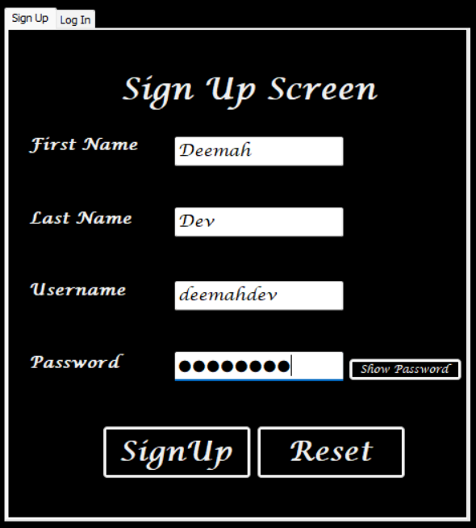
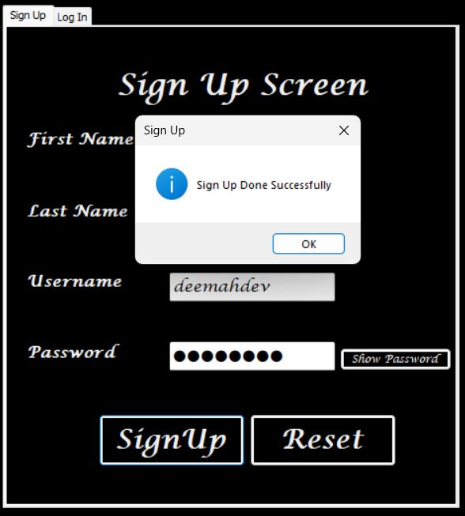
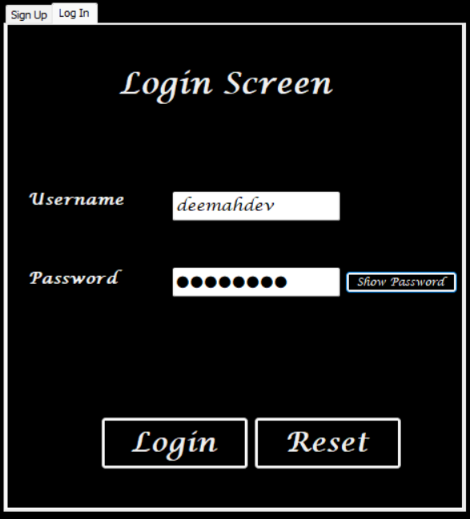
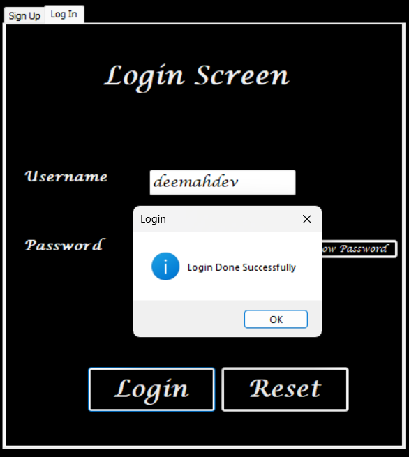

# 🔐 Login & Sign-Up System — WinForms (.NET FrameWork 4.8.1)

A simple **Login and Sign-Up system** built with **C# Windows Forms**.  
This project demonstrates file-based user authentication (using `.txt` file),
input validation, error handling, and a lock mechanism after multiple failed login attempts.

---

## 🧩 Features

- ✅ **Sign Up** new users and store their information securely in a local text file.  
- ✅ **Login** using stored credentials.  
- 🚫 **Lock system** after 3 failed login attempts for 10 seconds.  
- 🔒 **Password visibility toggle** (press and hold 👁️ button to show).  
- 🧼 **Automatic form cleanup** when leaving tabs or pressing “Restart” buttons.  
- ⚠️ **Validation with ErrorProvider** — empty text boxes aren’t accepted.

---

## 📂 File Structure

User data is stored in: LoginFile.txt
Each line in the file represents one user, stored as:
FirstName#//#LastName#//#Username#//#Password

---

## 🧠 Logic Overview

### 🔸 Sign-Up
When you click **Sign Up**, the system:
1. Validates all fields using `ErrorProvider`.
2. Writes the user data to `LoginFile.txt` using `StreamWriter`.
3. Displays a success message (`MessageBox`).

🖼️ **UI Example — Sign Up Screen:**  

🖼️ **UI Example — Sign Up Success Message:**  

### 🔸 Login
When you click **Login**, the system:
1. Reads all lines from `LoginFile.txt`.  
2. Looks for a match between the **username** and **password**.  
3. If found → shows success message.  
   If not found → increases failed attempts counter.

🖼️ **UI Example — Login Screen:**  

🖼️ **UI Example — Login Failed or Success Message:**  

---

🔸 **Lock Mechanism (Anti-Brute-Force)**  

If the user fails to log in **3 times**,
login fields are **disabled for 10 seconds**.  
🕒 This logic runs automatically
inside a **Timer control** to track lock duration.

---

🧽 **Auto-Cleanup Behavior**

- Leaving the **Sign-Up tab** → clears all sign-up fields.  
- Leaving the **Login tab** → clears all login fields.  
- Pressing **“Reset”** → clears the respective section immediately.

---

🧰 **Technologies Used**

| Component | Description |
|------------|--------------|
| Language | C# (.NET FrameWork 4.8.1) |
| Framework | Windows Forms |
| File Handling | StreamWriter / File.ReadAllLines |
| Validation | ErrorProvider |
| UI | WinForms Controls (TextBox, Button, Label, TabControl, Timer) |

---

🧩 **Future Improvements**

- 🔐 Encrypt passwords before storing them.  
- ⚙️ Add username uniqueness check on sign-up.  
- 🧠 Improve the search logic to match **exact username/password** (not partial match).  
- 💾 Add **“Remember Me”** checkbox and user role system.
